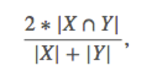
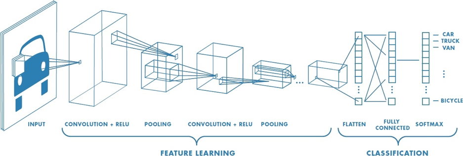
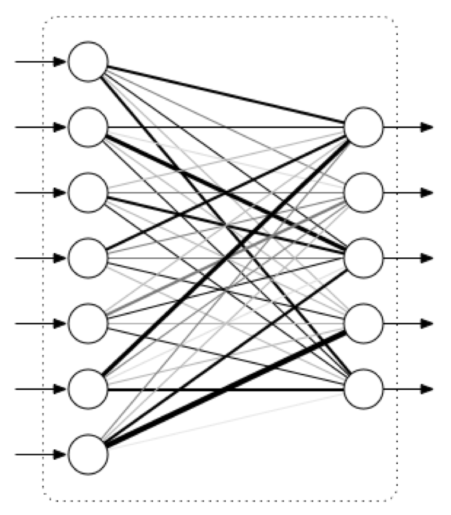

# carvana_image_masking

## ABSTRACT:
Data of 5000 images containing cars against a background is collected for training. This output expected is masked out car from the background. The masks used for training are obtained by manual masking. We train the network using car images as input and masks as expected output. Convolutional 2d neural network is used to train the network.

## OBJECTIVE: 
To obtain masks of cars and thereby masked out car image by using machine learning algorithms.

## TRAINING DATA:
5088 Images of cars in different directions is taken as training data. The output expected is mask of the image. So masks of all the images are given as expected output to the training algorithm.  
The masks are run-length encoded and put into a csv file so that it can be conveniently given as input to the network.

## RUN LENGTH ENCODING:
It is a way of compressing binary images or binary sequences. As mask is a binary image with values 0 and 1 at each pixel in the image. It can run length encoded and the values are put into a csv file with corresponding file names.

Example :
00011 = 32
00000011100 = 632

## GENERATING RUN LENGTH ENCODING:
The image starts with no of black pixel first and then comes no of white pixels. 
Example:
32 = 00011
632 = 00000011100

## TESTING DATA:
The trained model will later be tested with 100064 images to find the accuracy.

## ACCURACY METRIC:
To find the accuracy of the output, we use a metric called dice coefficient. This metric calculates pixel wise agreement between two pixels.
Dice coefficient is calculated using the below formula.

## ALGORITHM USED:
The algorithm use to solve this problem is a convolutional 2d network.
This network consists many layers arranged sequential. They are of 2 types
1.	Convolutional layer
2.	Max pooling layer

## 1.Convolutional layer:
This layer contains several matrices arranged over the image which are individually multiplied with its respective part in the image. This is used to find a particular pattern in an image. 

## 2.Max pooling:
In this method a 2*2 matrix is selected and maximum value from the matrix is selected. The 2*2 matrix is then replaced with this max value all over the image. This process is applied all over the image. In this way the image size is reduced to one-fourth of its original size.

## Connecting convolutional and max pooling layers:
Each convolutional layer in the network is used to recognize a different pattern in the image. In this way the connection of different convolutional layers is used to find the mask of the image that we give as input.
Each layer in convolutional network produces different no of outputs due to multiplication with different no of kernels. Ranging from 32 kernels to 256 kernels in  a layer.

Due to so many outputs produced we need to reduce the image size. To do this we use max pooling.

Many convolutional and max pooling layers are connected together to form the convolutional network that we use to derive masks from images.

## upscaling:
As max pooling is applied on images, upscaling is applied same no of times on the image finally to bring it back to original size.

## Fully connected layer:
Convolutional and max pooling layers are used to find different patterns across the image. Now all these layers must be connected finally to give the mask as output. This layer is called fully connected layer, the same as a regular neural network. 

## Fully connected network vs Conv2d network:
Fully connected network can be used to find mask of the image, but it would become unnecessarily complicated for this kind of problem. 
For example, in an image there is no relation between first pixel and last pixel to find the edges. 
So conv2d was created which was inspired by the way human brain analyses images. It analyses parts of the image separately.

## Image compression:
We compress all the images to size 128*128 so that the time taken for training the model is reduced. 
The size 128*128 is found to be right balance between size and also not losing the features required to find out the mask.

As the image size is larger the no of parameters increases and we would need more training data to train the model.
These three reasons especially the last one is the reason to compress the image.

## Output:
Using conv2d network with 3 convolutional layers

Using conv2d network with 50 steps per epoch and 1 epochs

Using conv2d network with 10 steps per epoch and 100 epochs

Using 50 steps per epoch and 10 epochs

## Accuracy:
An accuracy of 91.23% was obtained on the last model.

## References:
1.	https://www.kaggle.com/c/carvana-image-masking-challenge#description
2.	https://arxiv.org/abs/1608.07454

